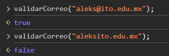
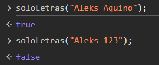
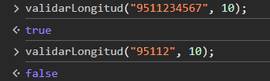
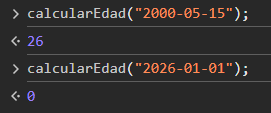
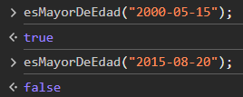
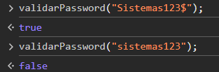
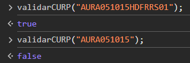
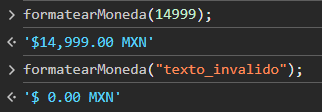

# Utilería — Librería de Validación y Utilidades JavaScript

**Instituto Tecnológico Nacional de México**
**Instituto Tecnológico de Oaxaca**

- **Carrera:** Ingeniería en Sistemas Computacionales
- **Materia:** Programación Web
- **Unidad:** Unidad 2
- **Docente:** Adelina Martínez Nieto
- **Alumno:** Aquino Rosales Aleks Jesús
- **Hora:** 10:00 - 11:00 a.m.

---

## ¿Qué problema resuelve?

En el desarrollo web, las validaciones de formularios y el formateo de datos son tareas repetitivas. Esta librería busca estandarizar estas operaciones, proporcionando funciones de JavaScript puro (Vanilla JS) reutilizables y fáciles de implementar, evitando la necesidad de frameworks pesados para tareas básicas.

Resuelve la necesidad de validar entradas de usuario (como correos, contraseñas seguras, números de teléfono y CURPs) y realizar cálculos comunes (como la edad o el formato de moneda), mejorando la integridad de los datos antes de ser procesados o almacenados.

---

## Estructura del Repositorio

```
Actividad2/
├── README.md
├── index.html          <- Formulario de registro principal y modal de resultados
├── login.html           <- Página de inicio de sesión de usuarios registrados
├── css/
│   └── styles.css       <- Estilos globales y diseño responsivo para las interfaces
└── js/
    ├── utileria.js       <- Core de la librería con funciones de validación y utilidad
    ├── app.js            <- Lógica de integración del registro y manejo del modal
    └── login.js          <- Lógica de autenticación usando localStorage
```

---

## Instalación

No requiere instalaciones complejas vía NPM ni configuraciones especiales.

Solo incluye el archivo `utileria.js` en tu documento HTML antes de los scripts que hagan uso de sus funciones:

```html
<script src="js/utileria.js"></script>
<!-- Luego incluye tu lógica de aplicación -->
<script src="js/app.js"></script>
```

---

## Funciones y Resultados

### Funciones Obligatorias

#### 1. `validarCorreo(correo)` → `boolean`

Verifica que el string proporcionado cumpla con el formato estándar de un correo electrónico (`usuario@dominio.com`).

```javascript
validarCorreo("aleks@ejemplo.com"); // true
validarCorreo("correo_invalido.com"); // false
```

#### 2. `soloLetras(texto)` → `boolean`

Asegura que la cadena contenga únicamente letras (incluyendo acentos y 'ñ') y espacios.

```javascript
soloLetras("Aleks Aquino"); // true
soloLetras("Aleks 123"); // false
```

#### 3. `validarLongitud(numero, maxLongitud)` → `boolean`

Comprueba que la representación en cadena de un número tenga exactamente la longitud especificada.

```javascript
validarLongitud(9516441805, 10); // true
validarLongitud(12345, 10); // false
```

#### 4. `calcularEdad(fechaNacimiento)` → `number`

Determina los años exactos basándose en una fecha de nacimiento (formato `YYYY-MM-DD`) y la fecha actual del sistema.

```javascript
calcularEdad("2000-05-15"); // 26 (Asumiendo año actual 2026)
calcularEdad(new Date().toISOString().split('T')[0]); // 0
```

#### 5. `esMayorDeEdad(fechaNacimiento)` → `boolean`

Utiliza `calcularEdad` para validar si la persona tiene 18 años o más.

```javascript
esMayorDeEdad("2000-01-01"); // true
esMayorDeEdad("2020-01-01"); // false
```

#### 6. `validarPassword(password)` → `boolean`

Fuerza estándares de seguridad exigiendo:

- Mínimo 8 caracteres
- Al menos una letra mayúscula
- Al menos una letra minúscula
- Al menos un número
- Al menos un carácter especial

```javascript
validarPassword("Aleks@2026"); // true
validarPassword("clave123"); // false (falta mayúscula y carácter especial)
```

### Funciones Propias

#### 7. `validarCURP(curp)` → `boolean`

Valida que la cadena ingresada corresponda a la estructura oficial de 18 caracteres de la Clave Única de Registro de Población mexicana.

```javascript
validarCURP("AURA040924HTCXRS01"); // true (ejemplo de formato válido)
validarCURP("AURA04"); // false
```

#### 8. `formatearMoneda(monto)` → `string`

Toma un valor numérico y lo devuelve como una cadena con formato de moneda mexicana (MXN), incluyendo el símbolo y separadores.

```javascript
formatearMoneda(15000); // "$ 15,000.00 MXN"
formatearMoneda("texto"); // "$ 0.00 MXN" (manejo de error básico)
```

---

## Integración en el Proyecto

### Formulario de Registro (`index.html`)

Se intercepta el evento de envío, se validan los campos y se muestran errores específicos usando el DOM. Si es exitoso, los datos (correo y password) se guardan en el `localStorage` de manera simulada para el login.

```javascript
formulario.addEventListener('submit', (e) => {
  e.preventDefault();
  // Limpieza de mensajes previos...
  const nombre = document.getElementById('nombre').value.trim();
  // Obtención de otros valores...

  let hayErrores = false;

  if (!soloLetras(nombre)) {
    document.getElementById('errorNombre').textContent = 'Solo se permiten letras y espacios.';
    hayErrores = true;
  }
  // Otras validaciones (correo, telefono, curp, password, edad)...

  if (!hayErrores) {
    localStorage.setItem('usuarioBD', JSON.stringify({ correo: correo, password: password }));
    // Preparar y mostrar modal
  }
});
```

### Ventana Modal (`dialog`)

Al registrarse correctamente, el modal presenta un mensaje personalizado usando la información validada y formateada.

```javascript
const edad = calcularEdad(fechaNac);
const sueldoFormateado = formatearMoneda(sueldo);

mensajeModal.innerHTML = `
  Bienvenido/a <strong>${nombre}</strong>.
  Hemos verificado tus datos. Tienes <strong>${edad} años</strong> (Eres mayor de edad).
  Tu sueldo esperado quedó registrado como <strong>${sueldoFormateado}</strong>.
`;
modal.showModal();
```

### Inicio de Sesión (`login.html`)

Verifica las credenciales ingresadas comparándolas con los datos previamente almacenados, empleando las validaciones base para sanitizar las entradas antes de verificar.

```javascript
formularioLogin.addEventListener('submit', (e) => {
  // ... prevención por defecto y obtención de valores ...

  if (!validarCorreo(correo)) { /* Mostrar error */ }
  if (!validarPassword(password)) { /* Mostrar error */ }

  const usuarioBDJSON = localStorage.getItem('usuarioBD');
  const usuarioBD = JSON.parse(usuarioBDJSON);

  if (correo === usuarioBD.correo && password === usuarioBD.password) {
    alert("¡Acceso concedido! Bienvenido al sistema.");
  } else {
    alert("Acceso denegado: Correo o contraseña incorrectos.");
  }
});
```

---

## Capturas de Pantalla — Consola Mostrando Resultados

- **1. validarCorreo:** 



- **2. soloLetras:**



- **3. validarLongitud:** 



- **4. calcularEdad:** 



- **5. esMayorDeEdad** 



- **6. validarPassword:** 



- **7. validarCURP:** 



- **8. formatearMoneda:** 



---

## Tecnologías

- **HTML5** — Estructura semántica, uso de `<dialog>` para el modal.
- **CSS3** — Flexbox, estilos modernos sin frameworks externos.
- **JavaScript vanilla** — DOM Manipulation, Event Listeners, `localStorage`, expresiones regulares.

---

## Demo y Video

- **GitHub Pages (Live Demo):** https://aleksardio.github.io/Actividad2-utileria.js/
- **Video Promocional (Máx 1 min):**https://youtu.be/MHsIbqTdwLQ
